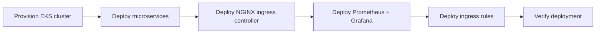

# Sock Shop on EKS

Deploys the [Sock Shop](https://microservices-demo.github.io/) microservices demo app to AWS EKS using Terraform, Helm, and a single GitHub Actions pipeline — cluster provisioning through monitoring, fully automated.

## Architecture



Each stage is a separate Terraform module with its own state, applied in dependency order by the pipeline.

## Stack

| Layer | Tool |
|---|---|
| Compute | AWS EKS |
| Infrastructure as Code | Terraform (S3 remote state) |
| Package management | Helm |
| Ingress | ingress-nginx |
| Monitoring | kube-prometheus-stack (Prometheus + Grafana) |
| CI/CD | GitHub Actions |
| Application | Sock Shop (11-service microservices demo) |

## What Gets Deployed

- **`kubernetes/micro-service`** — the Sock Shop namespace and all 11 microservices (front-end, catalogue, carts, orders, payment, shipping, user, and their datastores)
- **`kubernetes/nginx-controller`** — the ingress-nginx controller and its load balancer
- **`kubernetes/prometheus-helm`** — Prometheus and Grafana, via the kube-prometheus-stack chart
- **`kubernetes/ingress-rule`** — routing rules exposing the app and Grafana through the ingress controller

## Prerequisites

- An AWS account with permissions for EKS, EC2, IAM, and S3
- Two GitHub Actions secrets on this repo: `AWS_ACCESS_KEY_ID`, `AWS_SECRET_ACCESS_KEY`

## Deploying

Push to `main`, or trigger manually from the **Actions** tab. The pipeline:

1. Creates the EKS cluster (`eksctl`) and an S3 bucket for Terraform state, if they don't already exist
2. Applies each Terraform module in order, importing any resources that already exist live but aren't yet tracked in state (self-healing against interrupted runs)
3. Verifies the deployment with `kubectl get svc`

To tear everything down, run the workflow manually with `destroy: true`.

## Accessing the App

Get the load balancer's address:

```bash
kubectl get svc -n nginx-ingress
```

Without a custom domain pointed at it, map a hostname locally to test:

```bash
# /etc/hosts (Linux/Mac) or C:\Windows\System32\drivers\etc\hosts (Windows)
<load-balancer-ip>  sock-shop.yourdomain.com
<load-balancer-ip>  grafana.yourdomain.com
```

Then visit `http://sock-shop.yourdomain.com` for the app and `http://grafana.yourdomain.com` for Grafana. Update the `host` values in `kubernetes/ingress-rule` to match whatever domain you use.

Grafana's default login (`admin` / `prom-operator`) should be changed if this is ever exposed publicly.

## Repository Structure

```
.github/workflows/       GitHub Actions pipeline
kubernetes/
  micro-service/          Sock Shop application
  nginx-controller/       Ingress controller
  prometheus-helm/        Monitoring stack
  ingress-rule/           Ingress routing rules
```

## Notes

- No production domain is currently attached; the pipeline is set up to add ACM/Route 53 automation once one is owned.
- This is a demonstration deployment, not hardened for production traffic.